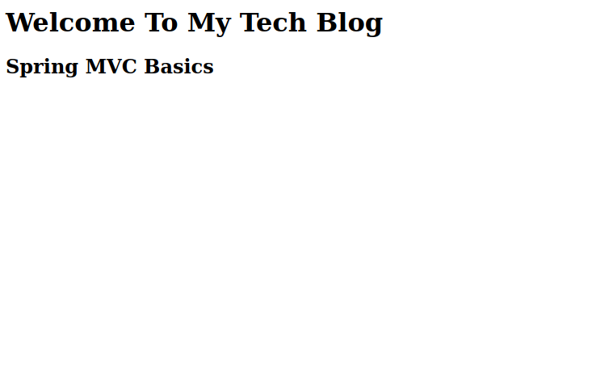

# Hepsiemlak-Java-Spring-Bootcamp-HW2

1-  Java dünyasındaki framework’ler ve çözdükleri problemler nedir? Kod Örneklendirini de 
içermelidir.

# Spring MVC

Spring MVC, Spring framework içinde bulunan, HTTP isteklerini ve cevaplarını kontrol eden bir kütüphanedir. Servlet API üzerine kurulmuştur. Spring MVC kütüphanesi Model-View-Controller mimarisini kullanır. Web uygulamaları geliştirmek için sahip olduğu hazır bileşenler esnek ve gevşek bağlı (loosely coupled) web uygulamalar geliştirme imkanı sağlar. Front controller tasarım kalıbını kullanır. Bu yapıda gelen istekleri karşılayan tek bir Servlet bulunur.

- Model, uygulamamızın verisi ve yapısını içerir. Yani uygulamanın kullandığı kuralları ve mantığı oluşturur. POJO'lardan oluşur.

- View, UI katmanı burada işlenir, tarayıcı için bir HTML cevabı döndürür.

- Controller gelen isteği işleyip modele ya da view'a yönlendirir.

## Spring MVC Framework Avantajları

- En önemli özelliği iş(bussiness), sunum(presentation) ve yönlendirme(navigation) mantığını birbirinden ayırmayı sağlar. (seperation of concerns)

- Seperation of concern sağladığındna modüler web uygulamalar oluşturmak için çok uygundur.

- Kolay test edilir. (Spring IOC kullandığı için)

- Ön yüzün ne olduğu önemsizdir. (view-agnostic)
  JSP, Velocity ya da farklı bir ön yüz teknolojisi kullanılabilir.

## Spring MVC Nasıl Çalışır?

Spring MVC web uygulaması geliştirmek için 3 komponent kullanır: model, view ve controller.

Spring MVC, Dispatcher Servlet etrafında kurgulanmıştır. Client'dan gelen istekleri ilk karşılayan yapı DispatcherServlet'tir. Ancak isteğin işleyen kısım Controller'dır. İsteği Contoller'a ileten HandlerMapping yapısı vardır. Örneğin gelen HTTP isteği "/addCustomer" şeklinde enpointe sahip olsun. HandlerMapping url'le eşleşen Controller'daki gerekli metodu bulur ve isteği iletir. Contoller bu aşamada model verisini set eder, geriye model döndürür. View bu model datasını işler ve tekrar DispatcherServlet'e iletir. Buradan da cevap client'a döner.

Program çıktısı:
